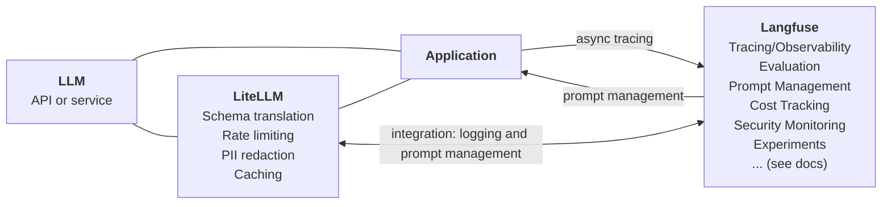
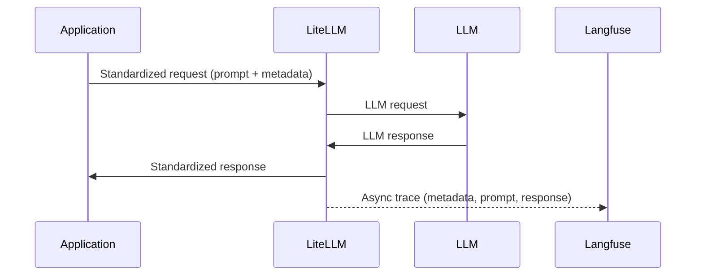

# Open Source LLMOps Stack

## Introduction

Choosing the right technology stack is one of the most critical decisions teams must make when building LLM-powered applications. The wrong choices can lead to vendor lock-in, limited flexibility, and high switching costs, all of which can stifle innovation and slow down iteration cycles.

Thus we want to introduce the "Open Source LLMOps Stack" as an open, well-integrated, scalable, and established setup backed by large OSS communities. It includes [LiteLLM](https://docs.litellm.ai/docs) ([GitHub](https://github.com/BerriAI/litellm)) as an LLM Proxy/Gateway and [Langfuse](https://langfuse.com/docs) ([GitHub](https://github.com/langfuse/langfuse)) for Observability, Evaluation and Prompt Management.

You can [deploy](/docs) this stack in a matter of minutes via the templates (HELM or docker compose) in your own environment.

Many teams are using this stack in production, some quotes by active contributors and users:

> “”
>
> — firstname lastname, title

> “”
>
> — firstname lastname, title

> “”
>
> — firstname lastname, title

Read on to learn more about the stack.

## The Challenge of Building Reliable LLM Applications

Building reliable LLM applications requires a stack that balances flexibility, observability, and control. Common problems of teams building LLM applications:

- **Model Selection** – With the rapid evolution of LLMs, teams need the ability to switch between different models and providers seamlessly. Some models may be better suited for cost efficiency, while others offer superior accuracy or response time. Different vendors have different APIs which can lead to lock-in and slower experimentation with new models.
- **Observability & Debugging** – LLM applications often use LLMs repeatedly and each step can lead to trace errors, latency issues, and suboptimal responses. Developers need tools to capture logs/traces, analyze model outputs, and track request flows in production to continuously improve system reliability.
- **Evaluating Free-Form Outputs** – Unlike deterministic software systems, LLMs generate varied responses, making evaluation non-trivial. Automated scoring, human-in-the-loop validation, and structured testing are necessary to ensure high-quality outputs across different use cases.
- **Collaborative Prompt Engineering** – LLM applications are often built by cross-functional teams where domain experts are in charge of prompt experimentation and annotation. When prompts are part of the application code it is often difficult to iterate quickly as developers need to be involved to change them.

## LiteLLM

> Model Routing, Load Balancing, and API Abstraction

[LiteLLM](https://docs.litellm.ai/docs) is an open-source LLM gateway that simplifies LLM usage by providing a unified API for interacting with multiple LLM providers. It offers teams:

### Model Routing & API Unification

- **Seamless API abstraction** – A single API layer that enables integration with models from OpenAI, Anthropic, Hugging Face, VertexAI, and more.
- **Dynamic model routing** – Configure rules to route requests based on performance, cost, or provider availability.
- **Built-in failover mechanisms** – Automatically switch to alternative models if a provider is down.
- **Load balancing** – Distribute traffic efficiently across multiple LLMs for scalability and reliability.

### Observability & Cost Management

- **Logging & request tracking** – Capture logs of all requests and responses for debugging and analysis.
- **Spend monitoring & budgeting** – Track API usage and costs across different providers to optimize expenses.
- **Latency tracking** – Identify and minimize delays in model responses.

### Prompt Management & Caching

- **Prompt versioning & A/B testing** – Manage different prompt iterations and compare effectiveness.
- **In-memory caching** – Reduce redundant calls and lower latency with built-in caching.
- **Streaming support** – Handle large responses more efficiently with token streaming.

## Langfuse

> Observability, Evaluation, and Prompt Management

\<Video with 10 min intro to Langfuse, [langfuse.com/watch-demo](http://langfuse.com/watch-demo)\>

[Langfuse](https://langfuse.com/docs) complements LiteLLM by offering deep visibility and structured evaluations for LLM-powered applications. It is designed around three core capabilities:

### Observability

- **Trace and monitor** multi-step LLM workflows, identifying bottlenecks or failure points.
- **Track cost and latency metrics** to optimize LLM spending.
- **Compare models** side-by-side to determine which is most effective for a given task.
- **Enable real-time debugging** to trace LLM requests and responses effectively.
- **Public APIs** to build custom workflows based on the data in Langfuse.

### Evaluation

- **Evaluate responses** with **both automatic and human-driven** assessments.
- **Custom evaluation** via the API and SDKs to build external eval workflows or track user feedback.
- **Manage datasets for evaluations** – Create labeled datasets from production traces for structured performance assessment.
- **Experiment with different models and workflows** – Test and refine LLM interactions without modifying production systems.

### Prompt Management

- **Collaborative Editing** – Change prompts via UI, API, or SDKs.
- **Versioning & Experimentation** – Store, track, and test different prompt versions efficiently.
- **Deployment** – Use deployment labels to assign prompt versions to different environments and quickly deploy or rollback prompt versions.
- **Production Readiness** – Use prompts in application code with no added latency impact due to SDK-level caching.
- **Interactive Playground** – Iterate on prompts within the Langfuse interface for real-time improvements.
- **Prompt-level Metrics** – Break down cost/quality/latency metrics by different prompt versions to understand the impact of changes.

## Integration

LiteLLM and Langfuse integrate directly, thereby you can use LiteLLM as a central model gateway and Langfuse for observability, evals and prompt management. To learn more, see the [integration docs](https://docs.litellm.ai/docs/proxy/logging#langfuse).

<Callout type="info">
  Using Langfuse Prompts directly via LiteLLM is currently in beta
  ([docs](https://docs.litellm.ai/docs/proxy/prompt_management)). Thereby you
  can only pass the prompt variables to the LLM request and all prompt
  fetching/caching is done by LiteLLM. Alternatively, you can rely on the
  Langfuse SDKs to use prompts in your application code
  ([docs](https://langfuse.com/docs/prompts/get-started)).
</Callout>

## Why This Stack?

Choosing the right LLM Ops stack is critical for teams that require long-term flexibility, scalability, and control over their AI infrastructure. Many proprietary solutions impose vendor lock-in, limiting adaptability and making it difficult to iterate on workflows as technology evolves.

By adopting the **Open-Source LLM Ops Stack**, teams gain:

- **Self-Hosting & Open Source** – Both LiteLLM and Langfuse are open-source, allowing teams to deploy them in their own infrastructure while ensuring complete control over their LLM operations.
- **Enterprise-Ready & Scalable** – These tools are built to handle large-scale deployments with robust performance, failover mechanisms, and high-availability setups.
- **Battle-Tested & Well-Documented** – Both projects are widely used in production environments and offer extensive documentation to support engineering teams.
- **Large Community & Active Development** – A vibrant open-source community actively contributes to both LiteLLM and Langfuse, ensuring continuous improvements, feature additions, and long-term viability.
- **Technology Independence** – Avoid reliance on a single cloud provider or LLM vendor, ensuring the ability to switch models and providers with minimal friction.

## Getting Started with the Open Source LLMOps Stack

Deploying the stack is straightforward:

1. **Deploy LiteLLM and Langfuse** – Run locally or in the cloud.
2. **Setup Integration** – Enable callbacks from LiteLLM to Langfuse.
3. **Replace model endpoints with LiteLLM** – Use LiteLLM gateway endpoints across your application.
4. **Done**

👉 [Follow the step-by-step tutorial here](/docs)

## Questions/Feedback?

We are very much looking forward to your feedback!

- OSS LLMOps Stack: [Repo](https://github.com/langfuse/oss-llmops-stack)
- LiteLLM: [Issue tracker](https://github.com/BerriAI/litellm/issues), [Discord](https://discord.com/invite/wuPM9dRgDw)
- Langfuse: [Issue tracker](https://github.com/langfuse/langfuse/issues), [GitHub Discussions](https://github.com/langfuse/langfuse/discussions), [Discord](https://langfuse.com/discord), [Ask AI](https://langfuse.com/docs/ask-ai)
